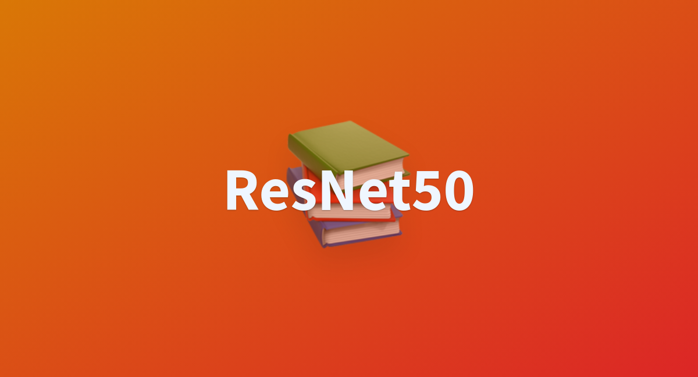
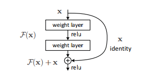
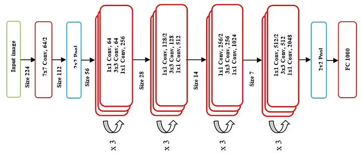
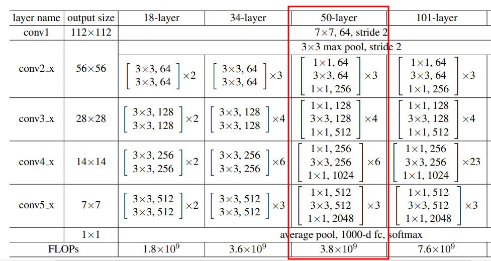

Authors of He et al. (2016) propose that residual layers with reference to the layer inputs are better at dealing with increased depth. 

The general problem with the deeper networks is that, as they they start to converge, accuracy gets saturated and degrades rapidly. This problem can be addressed with residual learning where layers are explicitly allowed to fit a residual mapping.

## Architecture

The architecture of ResNet50 is divided into four main parts: the convolutional layers, the identity block, the convolutional block and fully connect layers as the last part.

The input layer will be able to accomadate images with the size of `224x224`. We apply 64 [convolutional filters](https://d2l.ai/chapter_convolutional-neural-networks/conv-layer.html) of the size of `7x7` with the [strides](https://d2l.ai/chapter_convolutional-neural-networks/padding-and-strides.html) of 2. 

Then we perform max pooling operation on the output with a 3x3 filter and a stride of 2.

Since each residual blocks tend to reduce the number of parameters and computational complexity we call them `bottleneck`. Each bottleneck comprises of three convolutional layers and batch normalization layers. Following are the parameters passed into each of the residual blocks (bottleneck).

